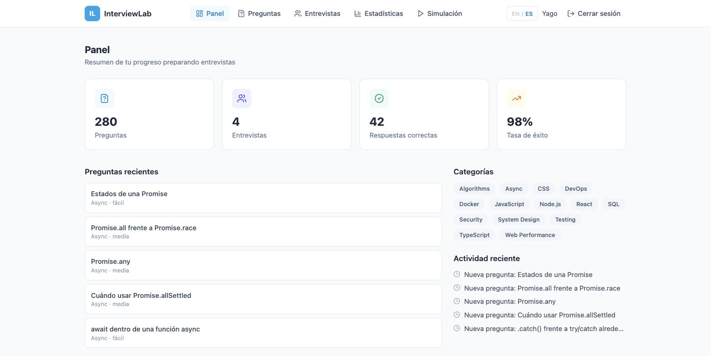
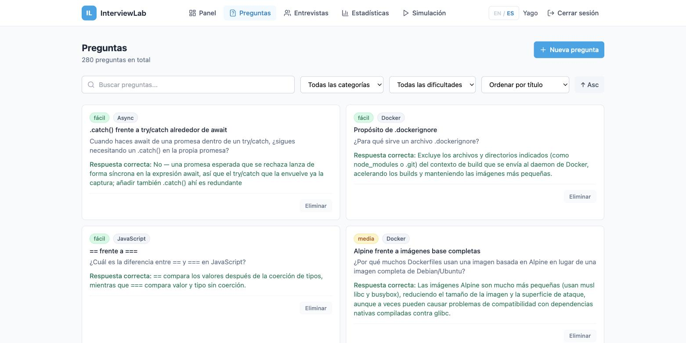
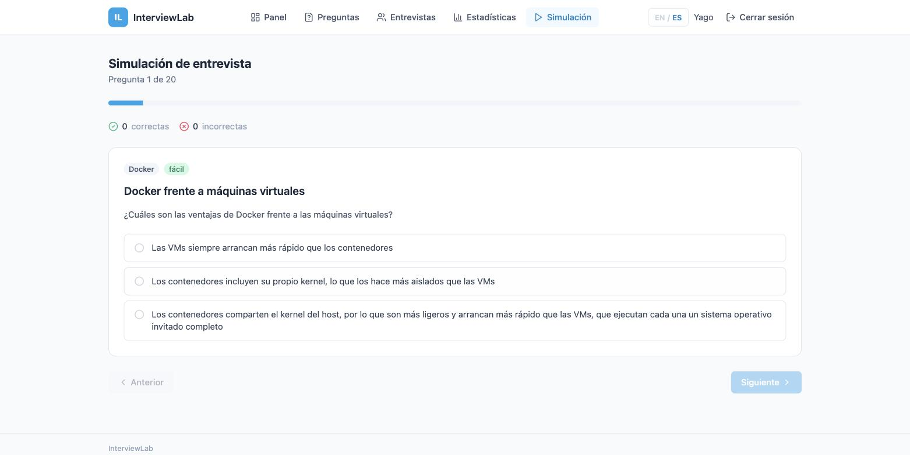
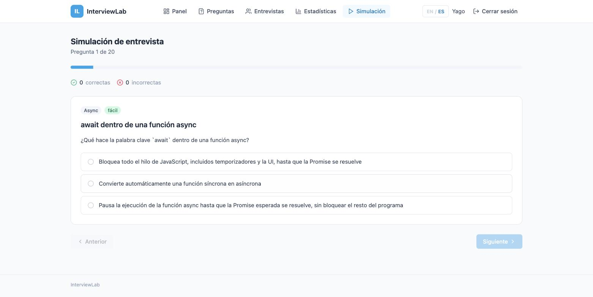
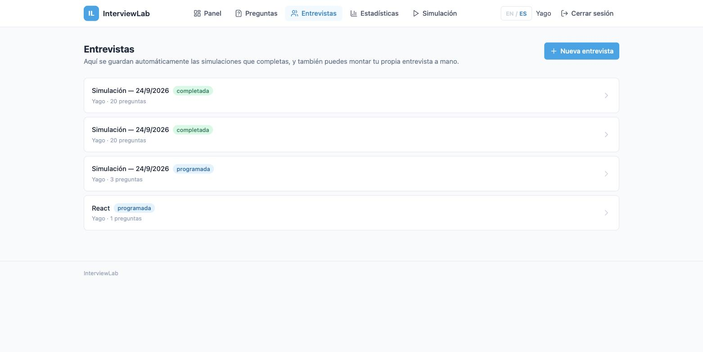
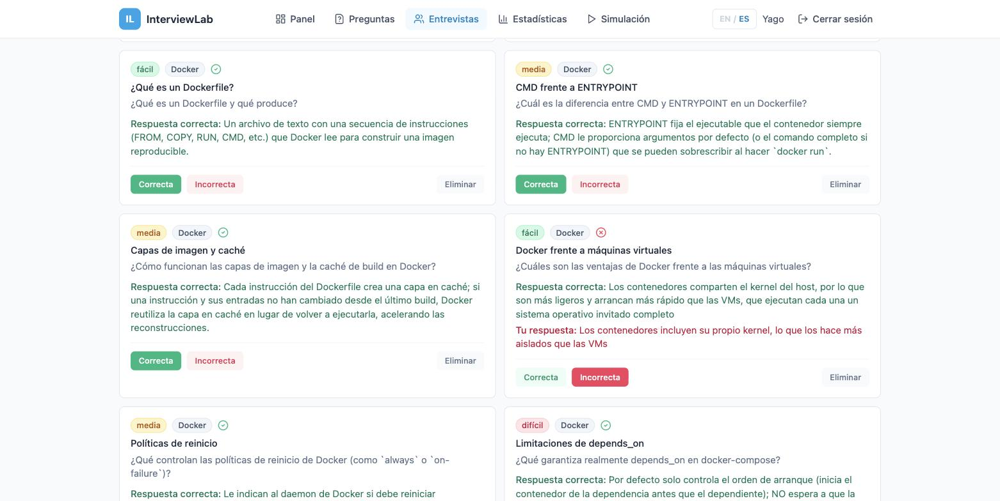
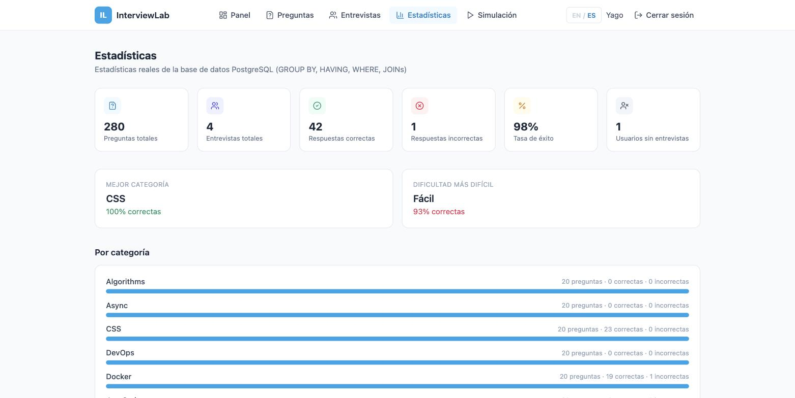

# InterviewLab

App web para practicar entrevistas técnicas: banco de preguntas, simulacros con checklist de opciones, entrevistas que guardan lo que respondiste, y estadísticas reales por usuario. React + TypeScript + Node/Express + PostgreSQL, con auth JWT e interfaz en inglés/español.

**En producción:** [interviewlab-navy.vercel.app](https://interviewlab-navy.vercel.app) — cuentas de demo: `alice@example.com` / `bob@example.com` / `carol@example.com`, contraseña `demo1234`.

---

## Capturas

| | |
|---|---|
|  **Panel** — resumen del progreso: preguntas totales, entrevistas, respuestas correctas y tasa de éxito, todo filtrado por el usuario logueado. |  **Banco de preguntas** — 280 preguntas en 14 categorías, con la respuesta correcta explicada debajo de cada una. |
|  **Simulación** — checklist de 3 opciones por pregunta; el orden se baraja en cada intento, así que la correcta no está siempre en el mismo sitio. |  **Categoría Async** — 20 preguntas sobre Promises, async/await, race conditions, AbortController y más, en inglés y español. |
|  **Entrevistas** — cada simulación completada se guarda aquí automáticamente, con su estado (programada / completada). |  **Detalle de entrevista** — se ve la respuesta correcta y, si fallaste, la opción que elegiste. |
|  **Estadísticas** — desglose por categoría y dificultad, calculado con `GROUP BY` / `HAVING` / `JOIN`s reales sobre PostgreSQL. | |

---

## Tabla de contenidos

1. [Arquitectura](#1-arquitectura)
2. [TypeScript — keyof vs typeof](#2-typescript--keyof-vs-typeof)
3. [React — useMemo](#3-react--usememo)
4. [React — useCallback](#4-react--usecallback)
5. [React — useState con función prev](#5-react--usestate-con-función-prev)
6. [Node.js — Event Loop](#6-nodejs--event-loop)
7. [Promise.all](#7-promiseall)
8. [Promise.allSettled](#8-promiseallsettled)
9. [SQL — INNER JOIN vs LEFT JOIN](#9-sql--inner-join-vs-left-join)
10. [SQL — WHERE vs HAVING](#10-sql--where-vs-having)
11. [Docker](#11-docker)
12. [Preguntas de entrevista](#12-preguntas-que-puedo-responder-después-de-construir-este-proyecto)

---

## 1. Arquitectura

```
React (Vite + TypeScript)
        ↓ HTTP / fetch
Node / Express (TypeScript)
        ↓
Controllers → Services → Repositories
        ↓ SQL parametrizado
PostgreSQL (Neon, en producción)
```

En local, los tres servicios corren en Docker (`docker-compose.yml`). En producción, todo se despliega junto en Vercel: el backend Express se expone como una única función serverless (`api/[...all].ts`) y la base de datos es Neon Postgres (PostgreSQL gestionado, vía Vercel Marketplace).

**Autenticación**: JWT. `POST /api/auth/register` y `/login` devuelven un token; el resto de rutas de interviews/statistics lo exigen vía middleware `requireAuth`, y `req.userId` se usa para que cada usuario solo vea sus propias entrevistas y estadísticas — nunca datos de otra cuenta.

**Internacionalización**: toda la interfaz (menús, botones, mensajes) y el contenido de las 280 preguntas (título, descripción y las 3 opciones) están traducidos a inglés y español. El selector `EN / ES` de la barra superior cambia ambos a la vez.

### Estructura del proyecto

```
interviewlab/
├── vercel.json                # Rewrites de producción (API + SPA)
├── docker-compose.yml         # Stack local: postgres + backend + frontend
├── database/
│   └── init.sql               # Schema + seed data (280 preguntas, 14 categorías)
├── backend/
│   ├── Dockerfile
│   ├── src/
│   │   ├── index.ts           # Entry point (Express app)
│   │   ├── config/
│   │   │   └── db.ts          # Pool de conexión a PostgreSQL
│   │   ├── types/
│   │   │   └── index.ts       # Tipos de dominio + uso de `typeof`
│   │   ├── repositories/      # SQL parametrizado
│   │   │   ├── questionRepository.ts
│   │   │   ├── categoryRepository.ts
│   │   │   ├── interviewRepository.ts
│   │   │   └── statisticsRepository.ts
│   │   ├── services/          # Lógica de negocio
│   │   │   ├── authService.ts
│   │   │   ├── questionService.ts
│   │   │   ├── categoryService.ts
│   │   │   ├── interviewService.ts
│   │   │   ├── statisticsService.ts
│   │   │   └── systemService.ts    # Dashboard con Promise.all
│   │   ├── controllers/       # HTTP handlers (finos)
│   │   ├── routes/            # Routers de Express
│   │   ├── middleware/
│   │   │   ├── auth.ts        # requireAuth / attachUser (JWT)
│   │   │   └── errorHandler.ts
│   │   └── utils/
│   │       └── sortBy.ts      # Sort genérico con `keyof`
│   └── tests/
│       └── sortBy.test.ts
├── src/                       # Frontend (usado por Vercel)
│   ├── App.tsx                # Router
│   ├── auth/
│   │   ├── AuthContext.tsx
│   │   └── ProtectedRoute.tsx
│   ├── i18n/
│   │   ├── translations.ts    # Textos EN/ES de la interfaz
│   │   └── localize.ts        # Localización del contenido de preguntas
│   ├── components/
│   │   ├── Navbar.tsx
│   │   ├── QuestionCard.tsx   # React.memo
│   │   ├── QuestionList.tsx   # useCallback
│   │   └── ui.tsx
│   ├── pages/
│   │   ├── DashboardPage.tsx
│   │   ├── QuestionsPage.tsx         # useMemo + keyof (sortBy)
│   │   ├── InterviewsPage.tsx
│   │   ├── InterviewDetailPage.tsx   # useCallback
│   │   ├── StatisticsPage.tsx        # useMemo
│   │   ├── SimulationPage.tsx        # setState(prev => ...), barajado de opciones
│   │   └── LoginPage.tsx
│   ├── services/
│   │   ├── api.ts             # Cliente HTTP + fallback a datos mock si el backend no responde
│   │   └── mockData.ts
│   └── types/
│       └── index.ts           # `typeof` usage
└── frontend/                  # Espejo de src/ para el build de Docker (mismo código)
```

### Separación de responsabilidades

```
Route → Controller → Service → Repository → Database
```

- **Route**: define la URL y el método HTTP.
- **Controller**: recibe la petición HTTP, valida inputs, llama al servicio y devuelve la respuesta HTTP con el status code correcto.
- **Service**: contiene la lógica de negocio. Orquesta repositorios y aplica reglas.
- **Repository**: contiene el SQL. Todas las consultas usan parámetros (`$1`, `$2`) para prevenir SQL injection.
- **Database**: PostgreSQL.

El SQL **nunca** aparece en controllers ni services. Los controllers **nunca** acceden a la base de datos directamente.

---

## 2. TypeScript — keyof vs typeof

### `keyof`

`keyof T` produce una unión de todos los nombres de propiedades de un tipo `T`.

```typescript
type Question = { id: number; title: string; difficulty: string };
type QuestionKey = keyof Question; // "id" | "title" | "difficulty"
```

Se utiliza en `src/utils/sortBy.ts` (frontend y backend) para restringir el segundo parámetro de la función `sortBy`:

```typescript
export function sortBy<T>(items: T[], key: keyof T, direction: "asc" | "desc" = "asc"): T[]
```

Esto significa que `sortBy(questions, "difficulty")` compila, pero `sortBy(questions, "nonexistent")` da un **error de compilación**.

**Dónde se usa**: `src/utils/sortBy.ts`, `backend/src/utils/sortBy.ts`

### `typeof`

`typeof` toma un valor que existe en runtime y extrae su tipo. Se usa para derivar tipos de constantes sin tener que re-declararlos.

En `src/types/index.ts` (frontend) y `backend/src/types/index.ts`:

```typescript
export const DIFFICULTIES = ["easy", "medium", "hard"] as const;
export type Difficulty = (typeof DIFFICULTIES)[number];
//   Difficulty = "easy" | "medium" | "hard"
```

La constante `DIFFICULTIES` existe en runtime (se puede iterar, comparar, etc.). Con `typeof` extraemos su tipo sin duplicar los valores.

**Dónde se usa**: `src/types/index.ts`, `backend/src/types/index.ts`

### Diferencia

| `keyof` | `typeof` |
|---------|----------|
| Opera sobre un **tipo** | Opera sobre un **valor** |
| Devuelve las **claves** de ese tipo | Devuelve el **tipo** de ese valor |
| `keyof Question` → `"id" \| "title" \| ...` | `typeof DIFFICULTIES` → `readonly ["easy", "medium", "hard"]` |

### Generics

La función `sortBy` es genérica: `sortBy<T>(...)`. El tipo `T` se infiere del array que se pasa como primer argumento, y `keyof T` se calcula a partir de ese `T`. Esto permite que la misma función funcione con `Question`, `Interview`, o cualquier otro tipo.

---

## 3. React — useMemo

`useMemo` memoriza el **resultado** de un cálculo. Solo lo recalcula cuando sus dependencias cambian.

### Dónde se usa

**`src/pages/StatisticsPage.tsx`** — cálculos derivados a partir de las estadísticas:

```typescript
const derivedStats = useMemo(() => {
  if (!stats) return null;
  // Calcular bestCategory, hardestDifficulty, correctRate...
  return { totalAnswered, correctRate, bestCategory, hardestDifficulty };
}, [stats]);
```

**`src/pages/QuestionsPage.tsx`** — filtro + ordenación de preguntas:

```typescript
const filteredQuestions = useMemo(() => {
  let result = questions;
  if (search) { /* filtrar por búsqueda */ }
  if (categoryFilter) { /* filtrar por categoría */ }
  return sortBy(result, sortByKey, sortDir);
}, [questions, search, categoryFilter, difficultyFilter, sortByKey, sortDir]);
```

### Por qué está memorizado

Estos cálculos iteran sobre arrays y realizan comparaciones en cada iteración. Sin `useMemo`, cada re-render del componente volvería a ejecutar el cálculo aunque las entradas no hayan cambiado — por ejemplo, cuando el usuario mueve el ratón o cuando un componente hermano se re-renderiza.

### Por qué NO usar useMemo en todo

`useMemo` tiene un coste: React almacena el valor y compara las dependencias en cada render. Para cálculos triviales (una suma, una concatenación), ese coste es mayor que el cálculo en sí. En este proyecto, **no** se memoriza el array `categories` que se pasa directamente al JSX — es una referencia simple que no necesita memoización.

---

## 4. React — useCallback

`useCallback` memoriza una **función**. Devuelve la misma referencia entre renders mientras las dependencias no cambien.

### Qué problema resuelve

En React, cada render crea nuevas funciones. Si pasas una función como prop a un componente hijo envuelto en `React.memo`, el hijo se re-renderiza aunque nada haya cambiado — porque `React.memo` hace una comparación superficial y la función es una referencia nueva.

### Dónde se usa

**`src/pages/QuestionsPage.tsx`**:

```typescript
const handleDelete = useCallback(async (questionId: number) => {
  await api.deleteQuestion(questionId);
  setQuestions((prev) => prev.filter((q) => q.id !== questionId));
}, []);
```

**`src/pages/InterviewDetailPage.tsx`**:

```typescript
const handleMarkCorrect = useCallback(async (questionId: number) => {
  await api.setAnswer(interviewId, questionId, true);
  // ...
}, [interviewId]);
```

Estos callbacks se pasan a `QuestionList` → `QuestionCard`. `QuestionCard` está envuelto en `React.memo`:

**`src/components/QuestionCard.tsx`**:

```typescript
export const QuestionCard = memo(QuestionCardBase);
```

Gracias a `useCallback` + `React.memo`, cuando marcas una pregunta como correcta, solo esa `QuestionCard` se re-renderiza — las demás mantienen su referencia de función y `React.memo` las salta.

### Qué significa "mantener la referencia de una función"

En JavaScript, `{}` !== `{}` y `() => {}` !== `() => {}`. Cada render del componente crea una función nueva en memoria. `useCallback` devuelve la **misma** función (misma referencia) mientras las dependencias no cambien. Esto permite que `React.memo` funcione: la comparación superficial ve la misma referencia y decide no re-renderizar.

### Por qué NO usar useCallback para todas las funciones

`useCallback` tiene un coste: React almacena la función y compara las dependencias en cada render. Para funciones que:
- Se usan solo dentro del componente (no se pasan como props)
- No son dependencia de ningún hook
- Se crean en un componente que no se re-renderiza frecuentemente

…no aporta ningún beneficio y solo añade overhead. En `QuestionList.tsx` hay un comentario explicando que los callbacks **ya** están estabilizados por el componente padre, por lo que no se envuelven de nuevo en `useCallback` dentro de `QuestionList`.

---

## 5. React — useState con función prev

Cuando un estado depende de su valor anterior, se debe usar la forma funcional:

```typescript
setScore(prev => prev + 1);
```

### Dónde se usa

**`src/pages/SimulationPage.tsx`** — contador de puntuación y navegación:

```typescript
setScore((prev) => prev + 1);           // incrementar puntuación
setWrongCount((prev) => prev + 1);      // incrementar errores
setCurrentIndex((prev) => prev + 1);    // siguiente pregunta
setCurrentIndex((prev) => Math.max(0, prev - 1)); // pregunta anterior
setAnswered((prev) => new Set(prev).add(questionId)); // marcar como respondida
```

### Por qué no es equivalente usar el valor del render

En React 18, las actualizaciones de estado se **batch** (agrupan). Si llamas `setScore(score + 1)` dos veces seguidas en el mismo tick, ambas llamadas usan el mismo valor de `score` capturado en el render actual — el resultado es un solo incremento en lugar de dos.

Con `setScore(prev => prev + 1)`, React pasa el valor **más reciente** del estado a la función, sin importar el batching. Cada llamada recibe el valor actualizado y se aplica correctamente.

**Ejemplo concreto**: en la simulación, si un usuario pulsa "Correcto" rápidamente dos veces (por ejemplo, vía teclado), `setScore(score + 1)` solo contaría 1 punto. `setScore(prev => prev + 1)` cuenta 2 puntos correctamente.

---

## 6. Node.js — Event Loop

### Conceptos

JavaScript se ejecuta principalmente en un **hilo principal** (main thread). En Node.js, este hilo ejecuta el código JavaScript y procesa el **Event Loop**.

**Event Loop**: es el mecanismo que permite a Node.js realizar operaciones I/O sin bloquear el hilo principal. Funciona en fases (timers, pending callbacks, poll, check, close callbacks). Cuando una operación asíncrona completa, su callback se encola para ser ejecutado en una fase futura del Event Loop.

**libuv**: es la librería C que implementa el Event Loop y el thread pool en Node.js. El thread pool (por defecto 4 threads) maneja operaciones que no pueden ser delegadas al sistema operativo — como operaciones de filesystem pesadas o ciertas funciones crypto.

**"Node es single-thread" es una simplificación**: el código JavaScript se ejecuta en un solo hilo, pero las operaciones I/O se delegan al sistema operativo o al thread pool de libuv. Mientras esas operaciones se completan, el hilo principal puede seguir atendiendo otras peticiones.

**microtasks vs macrotasks**: los callbacks de Promises se encolan como microtasks, que el Event Loop vacía por completo después de cada tarea síncrona y antes de pasar a la siguiente macrotask (como un `setTimeout`) — por eso un `.then()` siempre se ejecuta antes que un `setTimeout(fn, 0)` programado al mismo tiempo.

### Dónde se practica

Estos conceptos ya no viven en un endpoint de demo, sino en el banco de preguntas real: la categoría **Async** (`/simulation`, filtro "Async") tiene 20 preguntas de opción múltiple sobre el Event Loop, microtasks/macrotasks, `Promise.all`/`race`/`any`/`allSettled`, `AbortController`, race conditions y más — con la respuesta correcta explicada al fallar (ver [Entrevistas](docs/screenshots/entrevista-respuesta.jpg) en las capturas de arriba).

---

## 7. Promise.all

`Promise.all` recibe un array de promesas y espera a que **todas** se resuelvan. Si **una** falla, el `Promise.all` entero falla inmediatamente (fail-fast).

### Cuándo usarlo

Cuando tienes varias operaciones **independientes** y **necesitas todas** para continuar. Si una falla, el resultado no tiene sentido sin las demás.

### Dónde se usa

**`backend/src/services/systemService.ts`** — endpoint del dashboard:

```typescript
export async function getDashboardData(userId: number) {
  const [stats, recentQuestions, categories, recentActivity] = await Promise.all([
    statisticsService.getStatistics(userId),
    statisticsService.getRecentQuestions(5),
    categoryService.getAll(),
    statisticsService.getRecentActivity(10),
  ]);
  return { stats, recentQuestions, categories, recentActivity };
}
```

Las cuatro consultas son independientes (no se necesitan entre sí). Con `Promise.all` se ejecutan concurrentemente. Si fueran secuenciales (`await getStats(); await getQuestions(); ...`), el tiempo total sería la **suma** de los tiempos. Con `Promise.all`, es el **máximo**.

**Endpoint**: `GET /api/dashboard` (requiere sesión — `stats` está filtrado por el usuario logueado)

---

## 8. Promise.allSettled

`Promise.allSettled` recibe un array de promesas y espera a que **todas** terminen (resueltas o rechazadas). Nunca falla: devuelve un array de objetos `{ status: "fulfilled" | "rejected", value? | reason? }`.

### Cuándo usarlo

Cuando quieres resultados **parciales** — aunque algunas operaciones fallen, quieres lo que sí funcionó. Por ejemplo, llamar a varias APIs independientes donde un fallo parcial no debería tirar toda la respuesta abajo.

```typescript
const [a, b, c] = await Promise.allSettled([callApiA(), callApiB(), callApiC()]);
// aunque callApiB() rechace, a y c siguen disponibles
```

### Resumen: Promise.all vs Promise.allSettled

| `Promise.all` | `Promise.allSettled` |
|---------------|----------------------|
| Falla si **una** promesa falla | Nunca falla |
| Devuelve un array de valores | Devuelve array de `{ status, value/reason }` |
| Útil cuando necesitas **todo** | Útil cuando quieres **resultados parciales** |

Este proyecto tenía antes un endpoint de demo (`/api/dashboard/external`) que solo existía para ilustrar `Promise.allSettled` contra servicios simulados — se quitó por no aportar nada a la práctica de entrevistas. El concepto se sigue practicando vía la pregunta *"Cuándo usar Promise.allSettled"* en la categoría Async de `/simulation`.

---

## 9. SQL — INNER JOIN vs LEFT JOIN

### INNER JOIN

Devuelve solo las filas donde hay coincidencia en **ambas** tablas. Si una fila de la tabla izquierda no tiene coincidencia en la derecha, **no aparece**.

```sql
-- Interviews con sus usuarios (INNER JOIN)
SELECT i.id, u.name AS user_name, i.title
FROM interviews i
INNER JOIN users u ON i.user_id = u.id;
```

Solo aparecen entrevistas que tienen un usuario válido.

**Dónde se usa**: `backend/src/repositories/interviewRepository.ts`, `questionRepository.ts`

### LEFT JOIN

Devuelve **todas** las filas de la tabla izquierda, y las coincidencias de la derecha. Si no hay coincidencia, los campos de la derecha son `NULL`.

```sql
-- Usuarios que NO han realizado ninguna entrevista
SELECT u.id, u.name
FROM users u
LEFT JOIN interviews i ON i.user_id = u.id
WHERE i.id IS NULL;
```

Un usuario recién registrado aparece en los resultados porque todavía no tiene entrevistas. Con INNER JOIN no aparecería — no hay coincidencia en `interviews`.

**Dónde se usa**: `backend/src/repositories/statisticsRepository.ts` — `getUsersWithoutInterviews()`; también en el desglose por categoría, con `LEFT JOIN` desde `interview_questions`/`answers` filtrado por `user_id`, para que una categoría sin respuestas del usuario siga apareciendo con 0 correctas/incorrectas en vez de desaparecer de la lista.

### Resumen

| INNER JOIN | LEFT JOIN |
|------------|-----------|
| Solo filas con coincidencia en ambas tablas | Todas las filas de la izquierda + coincidencias |
| Si no hay match, la fila se excluye | Si no hay match, campos derechos = NULL |

---

## 10. SQL — WHERE vs HAVING

### WHERE

Filtra **filas individuales** **antes** de que se aplique `GROUP BY`.

```sql
WHERE q.difficulty IS NOT NULL   -- filtra preguntas antes de agrupar
```

### HAVING

Filtra **grupos** **después** de `GROUP BY`. Puede usar funciones de agregación (`COUNT`, `SUM`, etc.).

```sql
HAVING COUNT(DISTINCT q.id) >= $1   -- filtra categorías con >= N preguntas
```

### Consulta real (simplificada)

En `backend/src/repositories/statisticsRepository.ts` — desglose por categoría, ya scoped al usuario logueado:

```sql
SELECT c.name AS category,
       COUNT(DISTINCT q.id) AS question_count,
       COUNT(DISTINCT a.id) FILTER (WHERE a.is_correct = true)  AS correct_count,
       COUNT(DISTINCT a.id) FILTER (WHERE a.is_correct = false) AS incorrect_count
FROM categories c
INNER JOIN questions q  ON q.category_id = c.id
LEFT JOIN interview_questions iq ON iq.question_id = q.id
LEFT JOIN interviews i  ON i.id = iq.interview_id AND i.user_id = $2
LEFT JOIN answers a     ON a.interview_question_id = iq.id AND i.id IS NOT NULL
WHERE q.difficulty IS NOT NULL        -- ← WHERE: filtra filas antes de GROUP BY
GROUP BY c.name
HAVING COUNT(DISTINCT q.id) >= $1     -- ← HAVING: filtra grupos después de GROUP BY
ORDER BY question_count DESC
```

### Orden de ejecución lógico

```
FROM → JOIN → WHERE → GROUP BY → HAVING → SELECT → ORDER BY
```

### Resumen

| WHERE | HAVING |
|-------|--------|
| Filtra **filas** antes de agrupar | Filtra **grupos** después de agrupar |
| No puede usar funciones de agregación | Puede usar `COUNT()`, `SUM()`, etc. |

### Índices

El schema incluye índices para acelerar las consultas más frecuentes:

```sql
CREATE INDEX idx_interviews_user_id      ON interviews(user_id);
CREATE INDEX idx_questions_category_id   ON questions(category_id);
CREATE INDEX idx_questions_difficulty    ON questions(difficulty);
CREATE INDEX idx_interview_questions_int ON interview_questions(interview_id);
CREATE INDEX idx_interview_questions_q   ON interview_questions(question_id);
CREATE INDEX idx_answers_iq_id           ON answers(interview_question_id);
```

Los índices en claves foráneas aceleran los JOINs. El índice en `difficulty` acelera el filtro `WHERE difficulty = 'hard'`. `answers.interview_question_id` es además `UNIQUE` — lo necesita el `INSERT ... ON CONFLICT` que hace upsert de cada respuesta.

---

## 11. Docker

### Conceptos

- **Image**: plantilla de solo lectura con el código y dependencias. Se construye desde un `Dockerfile`.
- **Container**: instancia en ejecución de una image.
- **Docker Compose**: herramienta para definir y ejecutar múltiples containers con un solo archivo (`docker-compose.yml`).
- **docker exec**: ejecuta un comando dentro de un container en ejecución.

### docker-compose.yml

El proyecto define 3 servicios para desarrollo local:

- **postgres**: base de datos PostgreSQL 16. Monta `database/init.sql` como script de inicialización.
- **backend**: Node.js/Express. Se construye desde `backend/Dockerfile`. Depende de postgres (healthcheck).
- **frontend**: Vite dev server. Se construye desde `frontend/Dockerfile`. Depende de backend.

(En producción no se usa Docker — Vercel construye el backend como función serverless y sirve el frontend estático directamente.)

### Comandos

#### Arrancar el proyecto

```bash
docker compose up -d
```

#### Ver containers en ejecución

```bash
docker ps
```

#### Ver logs

```bash
docker logs interviewlab-backend
docker logs interviewlab-postgres
docker logs interviewlab-frontend
```

#### Parar el proyecto

```bash
docker compose down
```

#### Parar y borrar volúmenes (reset completo)

```bash
docker compose down -v
```

### Debugging con Docker

#### Entrar en el backend

```bash
docker exec -it interviewlab-backend /bin/sh
```

Dentro puedes:
- `node -e "console.log(process.env)"` — ver variables de entorno
- `wget -qO- http://localhost:4000/api/health` — comprobar que la API responde

#### Entrar en PostgreSQL

```bash
docker exec -it interviewlab-postgres psql -U interviewlab -d interviewlab
```

Dentro puedes:
- `\dt` — ver todas las tablas
- `SELECT * FROM questions LIMIT 5;` — ver preguntas
- `SELECT c.name, COUNT(q.id) FROM categories c INNER JOIN questions q ON q.category_id = c.id GROUP BY c.name HAVING COUNT(q.id) > 2;` — probar GROUP BY + HAVING
- `\q` — salir

#### Comprobar variables de entorno

```bash
docker exec interviewlab-backend printenv
```

#### Comprobar conectividad entre containers

```bash
docker exec interviewlab-backend ping -c 3 postgres
```

(O desde dentro del backend: `wget -qO- http://postgres:5432`)

---

## API Endpoints

| Método | Ruta | Descripción |
|--------|------|-------------|
| GET | `/api/health` | Health check |
| POST | `/api/auth/register` | Crear cuenta |
| POST | `/api/auth/login` | Iniciar sesión (devuelve JWT) |
| GET | `/api/auth/me` | Usuario autenticado actual |
| GET | `/api/questions` | Listar preguntas (filtros: `?category=`, `?difficulty=`, `?search=`) |
| GET | `/api/questions/:id` | Obtener una pregunta |
| POST | `/api/questions` | Crear pregunta |
| PUT | `/api/questions/:id` | Actualizar pregunta |
| DELETE | `/api/questions/:id` | Eliminar pregunta |
| GET | `/api/categories` | Listar categorías |
| GET | `/api/interviews` | Listar **tus** entrevistas (requiere sesión) |
| GET | `/api/interviews/:id` | Detalle de entrevista con preguntas |
| POST | `/api/interviews` | Crear entrevista |
| POST | `/api/interviews/:id/questions` | Añadir pregunta a entrevista |
| DELETE | `/api/interviews/:id/questions/:questionId` | Quitar pregunta de entrevista |
| PUT | `/api/interviews/:id/questions/:questionId/answer` | Guardar correcto/incorrecto + la opción elegida |
| PUT | `/api/interviews/:id/status` | Cambiar estado (`scheduled` / `in_progress` / `completed`) |
| GET | `/api/statistics` | Tus estadísticas (GROUP BY, HAVING, JOINs, requiere sesión) |
| GET | `/api/dashboard` | Panel (Promise.all, requiere sesión) |

---

## Tests

### Backend

```bash
cd backend
npm test
```

Testea `sortBy` — función genérica con `keyof` (5 tests).

### Frontend

```bash
cd frontend
npm test
```

Testea `sortBy` — función genérica con `keyof` (6 tests).

---

## 12. Preguntas que puedo responder después de construir este proyecto

### TypeScript

**¿Qué hace `keyof`?**
Devuelve una unión de todos los nombres de propiedades de un tipo. `keyof Question` → `"id" | "title" | "difficulty" | ...`. Se usa en `sortBy` para restringir el parámetro `key` a propiedades válidas.

**¿Qué hace `typeof`?**
Extrae el tipo de un valor que existe en runtime. `typeof DIFFICULTIES` → `readonly ["easy", "medium", "hard"]`. Se usa para derivar el tipo `Difficulty` sin duplicar los valores.

**¿Cuál es la diferencia entre `keyof` y `typeof`?**
`keyof` opera sobre un **tipo** y devuelve sus claves. `typeof` opera sobre un **valor** y devuelve su tipo.

**¿Qué son los generics?**
Permiten escribir funciones que funcionan con cualquier tipo manteniendo el type safety. `sortBy<T>` se adapta al tipo del array que recibe.

### React

**¿Qué hace `useMemo`?**
Memoriza el resultado de un cálculo. Solo recalcula cuando las dependencias cambian. Se usa en `StatisticsPage` para cálculos derivados.

**¿Cuándo NO usar `useMemo`?**
Para cálculos triviales donde el coste de memoizar es mayor que el cálculo mismo.

**¿Qué hace `useCallback`?**
Memoriza una función, manteniendo la misma referencia entre renders. Se usa para que componentes hijos con `React.memo` no se re-rendericen innecesariamente.

**¿Qué significa "mantener la referencia de una función"?**
En JS, cada render crea una función nueva (nueva referencia). `useCallback` devuelve la misma referencia mientras las dependencias no cambien, permitiendo que `React.memo` funcione.

**¿Por qué no usar `useCallback` en todas las funciones?**
Para funciones que no se pasan como props o no son dependencia de otros hooks, no aporta nada y añade overhead.

**¿Por qué usar `setState(prev => ...)`?**
Porque React 18 batchea las actualizaciones. Si usas el valor del render (`setScore(score + 1)`), múltiples llamadas en el mismo tick usan el mismo valor stale. Con `setScore(prev => prev + 1)`, cada llamada recibe el valor más reciente.

**¿Qué hace `React.memo`?**
Envuelve un componente y hace una comparación superficial de props. Si las props no cambiaron, salta el re-render.

### Node.js

**¿Qué es el Event Loop?**
El mecanismo que permite a Node.js realizar operaciones I/O sin bloquear el hilo principal. Funciona en fases (timers, poll, check, etc.).

**¿Qué es libuv?**
La librería C que implementa el Event Loop y el thread pool en Node.js.

**¿Node.js es single-thread?**
El código JS se ejecuta en un solo hilo, pero las operaciones I/O se delegan al SO o al thread pool de libuv (4 threads por defecto). Decir "single-thread" es una simplificación.

**¿Por qué un `.then()` corre antes que un `setTimeout(fn, 0)`?**
Los callbacks de Promise son microtasks; el Event Loop las vacía todas antes de procesar la siguiente macrotask (como un timer).

### Promises

**¿Cuándo usar `Promise.all`?**
Cuando tienes operaciones independientes y necesitas **todas** para continuar. Si una falla, el conjunto falla.

**¿Cuándo usar `Promise.allSettled`?**
Cuando quieres resultados parciales. Aunque algunas operaciones fallen, devuelves lo que sí funcionó.

**¿Cuál es la diferencia clave?**
`Promise.all` es fail-fast. `Promise.allSettled` nunca falla — devuelve el estado de cada promesa individualmente.

### SQL

**¿Qué devuelve `INNER JOIN`?**
Solo filas donde hay coincidencia en ambas tablas. Las filas sin match se excluyen.

**¿Qué devuelve `LEFT JOIN`?**
Todas las filas de la tabla izquierda. Si no hay coincidencia en la derecha, los campos derechos son NULL.

**¿Cuándo usarías `LEFT JOIN`?**
Para encontrar registros que NO tienen relación — por ejemplo, "usuarios sin entrevistas" (`LEFT JOIN ... WHERE i.id IS NULL`).

**¿Cuál es la diferencia entre `WHERE` y `HAVING`?**
`WHERE` filtra filas antes de `GROUP BY`. `HAVING` filtra grupos después de `GROUP BY`. `HAVING` puede usar funciones de agregación.

**¿Por qué hay índices en el schema?**
Para acelerar los JOINs (claves foráneas) y los filtros WHERE. Un índice en `difficulty` hace que `WHERE difficulty = 'hard'` sea O(log n) en vez de O(n).

### Docker

**¿Qué es una image vs un container?**
La image es la plantilla (código + dependencias). El container es la instancia en ejecución.

**¿Qué hace `docker compose`?**
Define y arranca múltiples containers desde un solo archivo `docker-compose.yml`, gestionando sus redes y dependencias.

**¿Qué hace `docker exec`?**
Ejecuta un comando dentro de un container en ejecución. Se usa para debugging — entrar al backend, a PostgreSQL, etc.

**¿Cómo compruebas los logs de un container?**
`docker logs <container-name>`

---

## Cómo arrancar en local

```bash
# 1. Situarse en el directorio del proyecto
cd interviewlab

# 2. Arrancar todos los servicios
docker compose up -d

# 3. Verificar que están corriendo
docker ps
```

### URLs en local

| Servicio | URL |
|----------|-----|
| Frontend | http://localhost:5173 |
| Backend API | http://localhost:4000/api |
| Health check | http://localhost:4000/api/health |

### Páginas del frontend

| Página | Ruta | Requiere sesión |
|--------|------|:---:|
| Panel | `/dashboard` | Sí |
| Preguntas | `/questions` | No |
| Entrevistas | `/interviews` | Sí |
| Estadísticas | `/statistics` | Sí |
| Simulación | `/simulation` | No (pero solo guarda el resultado si has iniciado sesión) |
| Iniciar sesión | `/login` | — |

---

## Seguridad y calidad

- **SQL injection**: todas las consultas usan parámetros (`$1`, `$2`, ...). Nunca concatenación de strings.
- **Auth**: JWT + bcrypt para el hash de contraseñas. Cada entrevista y respuesta queda ligada al `user_id` de quien la creó.
- **CORS**: configurable via `CORS_ORIGIN` en variables de entorno.
- **Validación de inputs**: `validateRequired()` en controllers.
- **HTTP status codes**: 200, 201, 204, 400, 401, 404, 500.
- **Variables de entorno**: `DATABASE_URL`, `JWT_SECRET`, `CORS_ORIGIN`, etc. Sin secretos hardcodeados.
- **Separación de responsabilidades**: Route → Controller → Service → Repository.
- **Sin ORM**: SQL real y legible en los repositories.
- **TypeScript estricto**: `strict: true` en frontend y backend.
